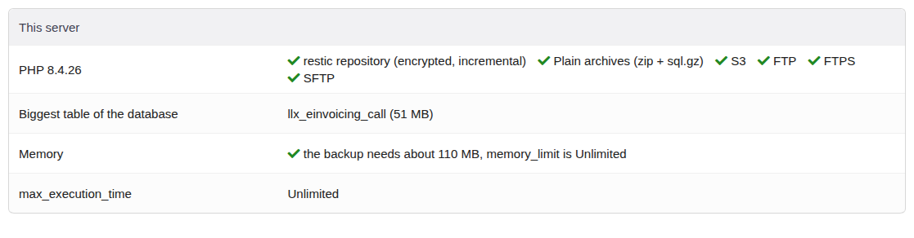
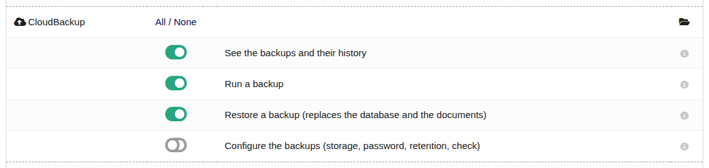
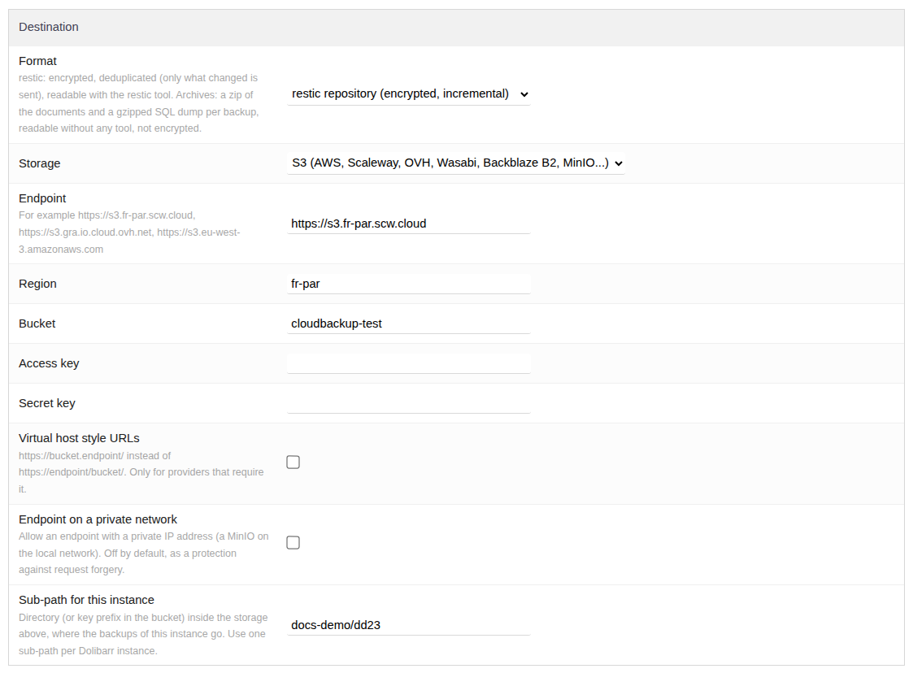
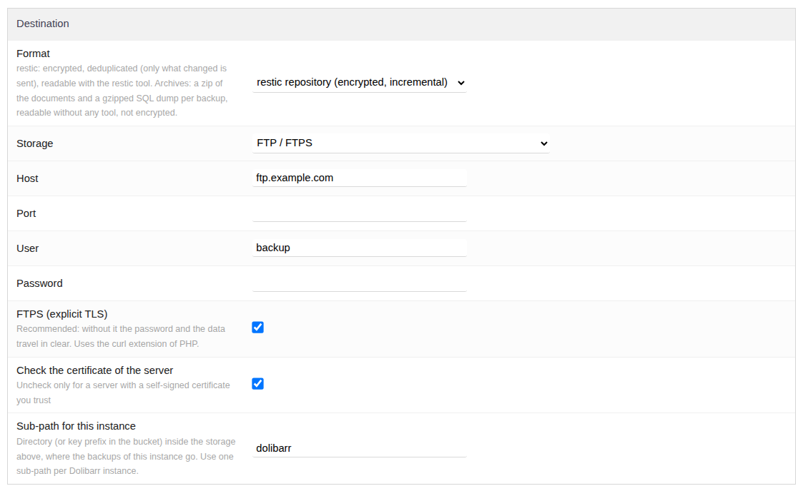
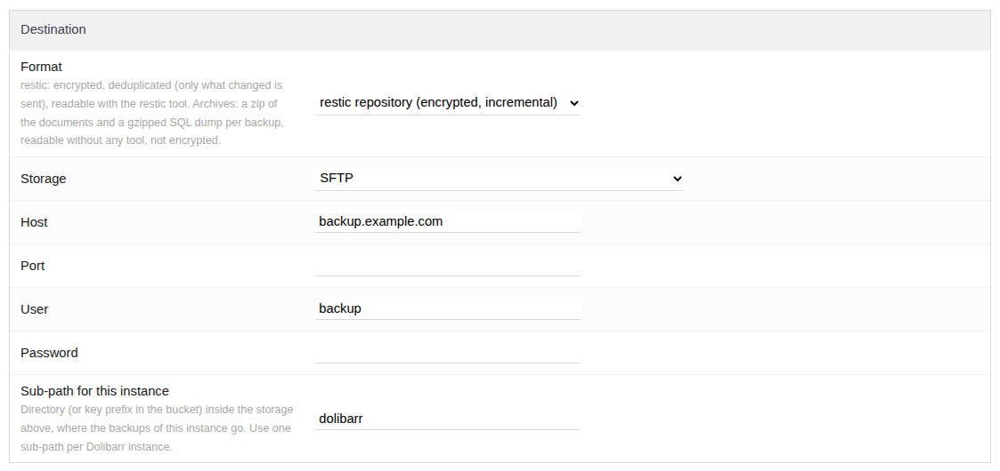
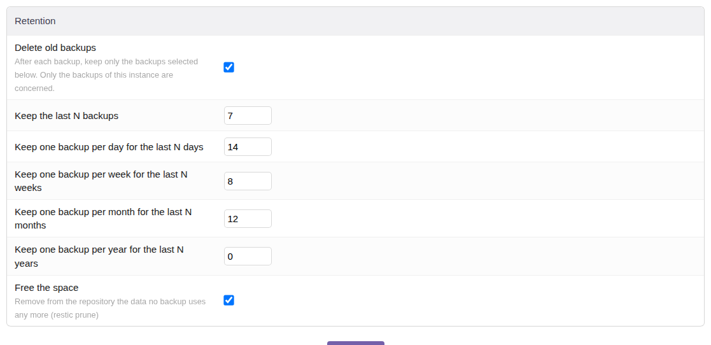
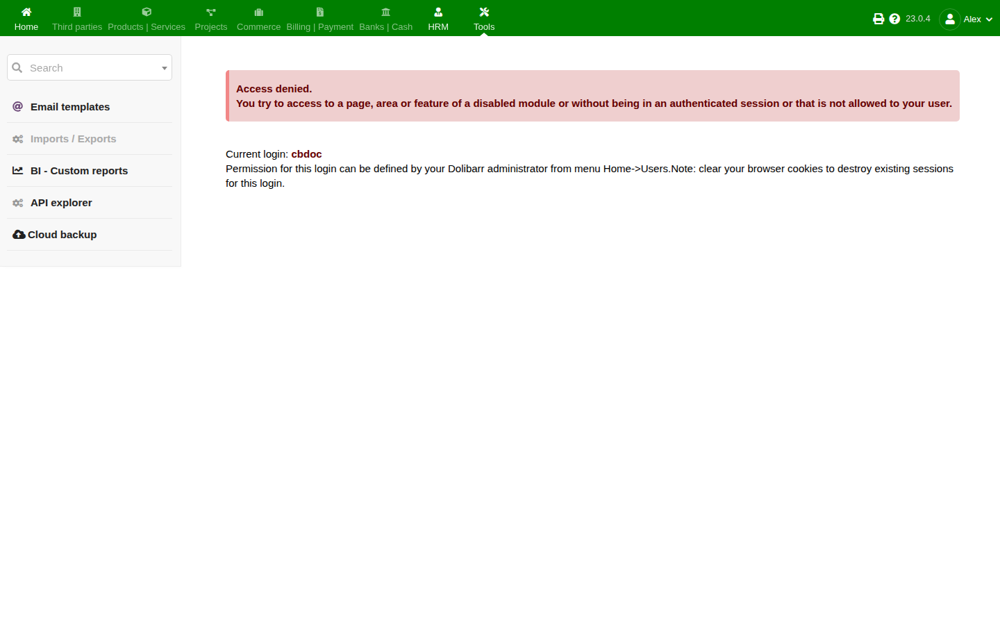

# CloudBackup — configuration

CloudBackup backs up the database and the documents of Dolibarr to a S3 bucket, a FTP/FTPS or SFTP
server, or a directory of the server, on a schedule or on demand, and restores them from Dolibarr.
It runs on shared hosting: no shell, no binary, no system package. This page covers the installation
and every setting; [usage.md](usage.md) covers backups, restores and disaster recovery.

## 1. Requirements

| | |
|---|---|
| Dolibarr | 18 or newer |
| PHP | 7.1 or newer, 64-bit |
| Database | MySQL or MariaDB (the PHP dump of Dolibarr does not handle PostgreSQL) |
| Module | *Scheduled jobs* (Cron), enabled automatically with CloudBackup |

Each storage and format needs a PHP extension. The setup page shows what the server has, and greys out
what it cannot run:

| Choice | Needs | Usually there on shared hosting |
|---|---|---|
| restic format | openssl, 64-bit PHP | yes |
| Archive format | zip, zlib | yes |
| S3 | curl | yes |
| FTP | ftp | yes |
| FTPS | curl built with FTPS | yes |
| SFTP | ssh2 | rarely: ask your host, or use S3/FTPS |
| Directory of the server | — | yes |



## 2. Installation

1. Download the module from the community modules of Dolibarr (*Home > Setup > Modules > Deploy/install
   external app*), or put the `cloudbackup` directory in `htdocs/custom/`.
2. *Home > Setup > Modules*: enable **CloudBackup** (family *Base*). The scheduled job is created
   **disabled**: it is enabled at the end of the setup, once the connection test passes.
3. Give the permissions (*Home > Users > a user > Permissions > CloudBackup*):

| Id | Permission |
|---|---|
| 9504011 | See the backups and their history |
| 9504012 | Run a backup |
| 9504021 | Restore a backup — it replaces the database and the documents |
| 9504031 | Configure the backups, check the storage, remove locks |

An administrator always has all of them. The menu entry is *Tools > Cloud backup*, and for
administrators also *Home > Admin tools > Cloud backup*.



## 3. The setup page

*Home > Setup > Modules > CloudBackup* (the gear icon). The page has four blocks.



### This server

What the server can run, the biggest table of the database and the memory a backup needs. The PHP
dump of Dolibarr reads the biggest table in memory at once (measured: about its size with PHP 8,
twice with PHP 7), so a table of 300 MB needs more than 300 MB of `memory_limit`.

- **tick**: fine, or the host lets the module raise the limit for the backup (it does it by itself);
- **warning**: the host does not allow raising it. Ask for more memory, or run the backups from the
  scheduled job: the command line PHP of the host often has no limit.

`max_execution_time` concerns the *Back up now* button only: a big instance may take longer than a web
request is allowed to. The scheduled job has no time limit.

### Destination

**Format**

- **restic repository** (recommended). Encrypted (AES-256 + Poly1305), deduplicated: after the first
  backup only what changed is sent, and unchanged documents are not read again. The repository follows
  the format of the [restic](https://restic.net) tool, which can read it, check it and restore it
  without Dolibarr.
- **Plain archives**. Each backup is a folder holding the gzipped SQL dump, a zip of the documents and a
  `manifest.json`, cut in 16 MB parts. Readable with no tool at all, but **not encrypted** and sent in
  full every time.

**Storage**, then its access settings, then **Sub-path for this instance**: a directory, or a key prefix
in a bucket, inside the storage. Use one sub-path per Dolibarr instance: a sub-path holds one repository.

#### S3 (AWS, Scaleway, OVH, Wasabi, Backblaze B2, MinIO…)

| Field | Example (Scaleway, Paris) |
|---|---|
| Endpoint | `https://s3.fr-par.scw.cloud` |
| Region | `fr-par` |
| Bucket | `my-company-backups` (create it first, in the console of the provider) |
| Access key / Secret key | the API key of an account limited to this bucket |
| Virtual host style URLs | off, unless the provider requires `https://bucket.endpoint/` |

Other endpoints: OVH `https://s3.gra.io.cloud.ovh.net` (region `gra`), AWS
`https://s3.eu-west-3.amazonaws.com` (region `eu-west-3`), Backblaze B2
`https://s3.eu-central-003.backblazeb2.com` (region `eu-central-003`), Wasabi
`https://s3.eu-central-1.wasabisys.com`.

Give the key the smallest rights that work: read, write, delete and list the objects of this bucket
only. **Do not enable versioning nor an object lock** on the bucket unless you know why: the retention of
the module deletes objects, and a versioned bucket would keep them (and bill them).

*Endpoint on a private network* allows an endpoint with a private IP address (a MinIO on the local
network). It is off by default: Dolibarr refuses private addresses to prevent request forgery.

#### FTP / FTPS



Host, port (21), user, password. The sub-path is relative to the home directory of the FTP account.

- **FTPS** (explicit TLS) encrypts the password and the transfers: use it whenever the server offers it.
  It goes through the curl extension of PHP (the only PHP client that works with every FTPS server).
- **Check the certificate of the server**: leave it on. Turn it off only for a server with a
  self-signed certificate you trust.

With plain FTP the password travels in clear: combine it with the restic format, at least the data
itself is encrypted.

#### SFTP



Host, port (22), user, password. The sub-path is relative to the home directory unless it starts with `/`.
Needs the PHP extension ssh2: when it is missing, the choice is greyed out.

#### Directory of the server

**Local directory**: an absolute path **outside** the documents directory of Dolibarr (the module refuses a path inside: a
backup must not be lost with the data it protects). Useful for a second disk or a directory synchronised
by another tool; it does not protect against the loss of the server. The backups go into
`Local directory/Sub-path for this instance`.

On shared hosting the absolute path is rarely known: the help of the field shows the documents directory,
and the page suggests a directory next to it, out of the web root (on cPanel, the home of the account:
`/home/<account>/cloudbackups`); *Use it* fills the field. Saving checks the path, creates the directory
and checks that PHP can write in it; a directory served by the web server is accepted with a warning,
as anyone guessing its address could download the backups. The backups can then be downloaded from the
*Backups* page, without an FTP access.

### Encryption

**Repository password** (restic format): at least 12 characters. It encrypts the backups.

> **Keep a copy of this password outside Dolibarr** (password manager, safe). If the server is lost,
> the password stored in its database is lost with it, and without the password nobody can read the
> backups — not even you.

Changing the password later does not re-encrypt an existing repository: to use another password, use
another path.

### Content

| Option | |
|---|---|
| Database | the dump of the backup tool of Dolibarr, in its PHP flavour (no `mysqldump` needed) |
| Documents directory | without temporary files, logs, previews, old dumps and `install.lock`, as the backup tool of Dolibarr does |
| External modules | the code of `htdocs/custom` (symbolic links are not followed) |
| conf.php | restic format only, stored encrypted, never restored automatically. Its `$dolibarr_main_instance_unique_id` decrypts the passwords stored in the database: a restore on a new server needs it |
| Excluded paths | one pattern per line, relative to the documents directory: `ecm/videos/*`, `*/big-*.zip` |

### Retention

After each backup the module deletes the backups the rules do not keep, **for this instance only**, then
frees the space (*prune*): data no remaining backup uses is deleted, packs partly used are rewritten.

| Rule | Keeps |
|---|---|
| last N | the N most recent backups |
| daily / weekly / monthly / yearly N | the most recent backup of each of the N last days / weeks / months / years that have one |

The rules add up. The defaults (7 last, 14 daily, 8 weekly, 12 monthly) keep about a year of history.
When a rule has fewer periods than asked, the oldest backup is kept too, as restic does. The plain
archive format only has *last N*.



## 4. Test, then schedule

1. **Save**, then **Test the connection**: the module writes an object, reads it back and deletes it.
2. **Back up now** on the *Backups* tab, and read its log.
3. **Edit the schedule**: this opens the scheduled job *CloudBackup: back up the database and the
   documents*. Enable it and set its frequency (daily is a good start) and its first run (at night).

Scheduled jobs of Dolibarr run when something calls the job runner. On a shared hosting, add a cron
task in the hosting panel (cPanel > *Cron Jobs* at o2switch), every 5 or 15 minutes, with **one** of:

```sh
# command line: no time limit, the recommended way
php /home/account/www/dolibarr/scripts/cron/cron_run_jobs.php CRON_KEY admin

# or a call to an URL, if the panel only runs URLs (a web request has a time limit)
wget -q -O /dev/null "https://erp.example.com/public/cron/cron_run_jobs_by_url.php?securitykey=CRON_KEY&userlogin=admin"
```

`CRON_KEY` is the security key shown in *Home > Setup > Modules > Scheduled jobs*. The setup page of
CloudBackup prints both lines with the right paths.


