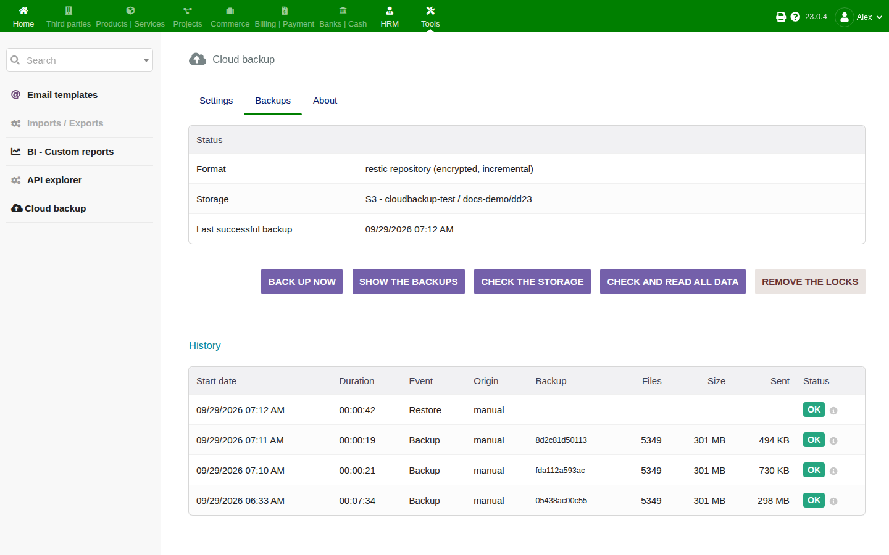
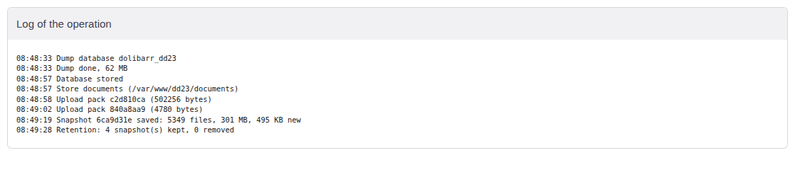
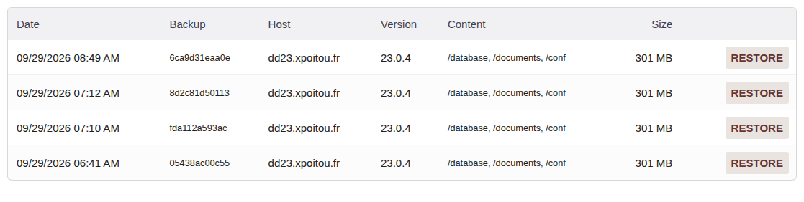
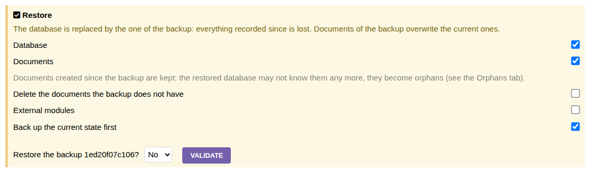
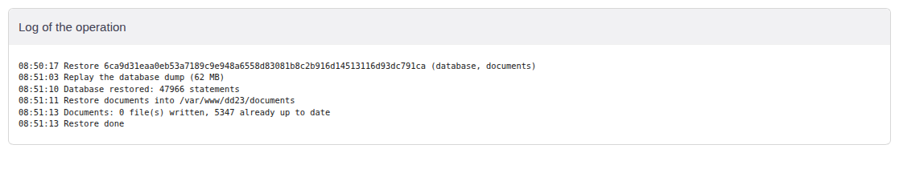
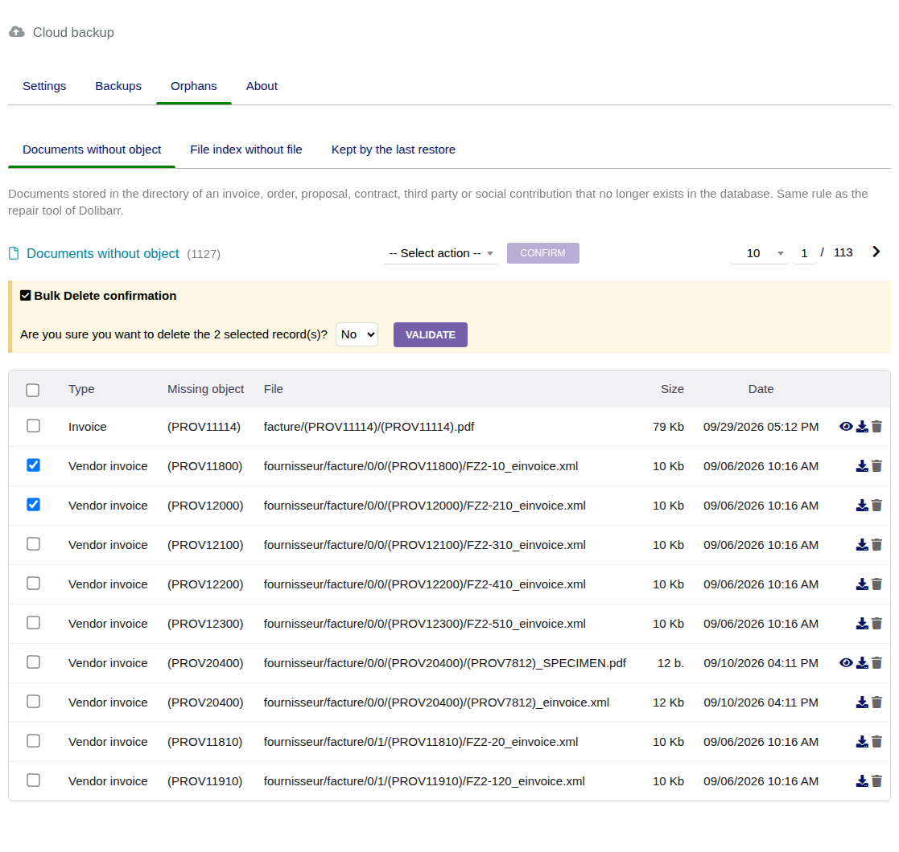
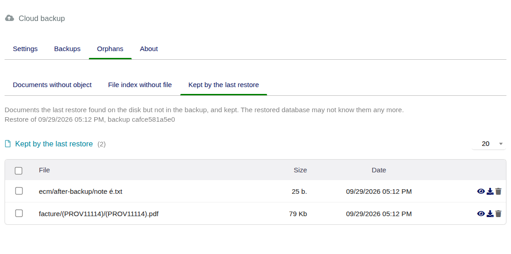

# CloudBackup — utilisation

Lancer les sauvegardes, lire leur historique, restaurer, et reprendre un Dolibarr perdu avec son
serveur. Les réglages sont décrits dans [configuration.md](configuration.md).

## 1. La page Sauvegardes

*Outils > Cloud backup* (ou *Accueil > Outils d'administration > Cloud backup*).



- **État** : format, stockage, date de la dernière sauvegarde réussie. Un avertissement apparaît quand la
  dernière réussite a plus de deux jours, ou quand un prérequis manque (extension, mot de passe, mémoire).
  L'**espace occupé sur le stockage** est mesuré après chaque sauvegarde et chaque vérification (lister un
  stockage distant prend du temps) ; en restic, il donne aussi le volume de données contenu, ce qui montre
  le gain de la déduplication. La place libre n'est pas affichée : PHP voit le disque du serveur, pas le
  quota d'un hébergement mutualisé.
- **Sauvegarder maintenant** (droit *Lancer une sauvegarde*) : lance une sauvegarde dans la page et
  affiche son journal. Sur une grosse instance, préférer le travail planifié : une requête web a une
  limite de temps.
- **Voir toutes les sauvegardes** (*Show all backups*) : liste les sauvegardes présentes sur le stockage.
  En format archive, les 5 plus récentes s'affichent d'office ; en restic, la liste attend ce bouton
  (ouvrir le dépôt dérive sa clé, quelques secondes).
- **Vérifier le stockage** / **Vérifier et relire toutes les données** (droit *Configurer*) : voir §4.
- **Retirer les verrous** (restic, droit *Configurer*) : voir §5.
- **Historique** : chaque sauvegarde, restauration et interruption, avec durée, taille, volume envoyé et
  journal (icône *i*). Les 5 dernières lignes ; *Show the whole history* affiche le reste.



Une sauvegarde, toujours :

1. exporte la base avec l'outil de sauvegarde PHP de Dolibarr (MySQL/MariaDB) ;
2. stocke le dump, les documents (et en option `htdocs/custom` et `conf.php`) — en restic, un fichier
   dont la taille et la date n'ont pas changé depuis la dernière sauvegarde n'est pas relu, et le dump
   est découpé sur ses propres lignes : quelques lignes modifiées n'envoient que les morceaux autour ;
3. applique la rétention et libère la place.

Une seule opération à la fois par instance. Un processus tué par l'hébergeur (limite de temps ou de
mémoire) clôt son exécution en *Interrompue* et libère son verrou.

## 2. Lister les sauvegardes



La liste montre chaque sauvegarde du stockage : date, identifiant, instance qui l'a faite, version de
Dolibarr, contenu, taille. Les sauvegardes d'**une autre instance** partageant le même chemin
apparaissent aussi (et sont signalées) : un nouveau serveur peut ainsi restaurer celles de l'ancien. Un
avertissement à côté de la version signale une sauvegarde d'une autre version de Dolibarr : après avoir
restauré sa base, lancer la mise à jour de Dolibarr (`/install/`).

Avec le droit de configuration, la colonne *Download* donne les fichiers de chaque sauvegarde, lus sur le
stockage et envoyés au fil de l'eau, sans copie sur le serveur : pas besoin d'accès FTP sur un
mutualisé. Une archive donne ses fichiers tels quels (`<base>.sql.gz`, `documents.zip`, `custom.zip`) ;
une sauvegarde restic donne son dump (`.sql`) et ses répertoires en `.tar` (ouverts par Windows 10 et
suivants, macOS, Linux, 7-Zip). Ces fichiers contiennent toute la base en clair : les garder en lieu sûr.
Chaque téléchargement est inscrit dans l'historique.

## 3. Restaurer

Droit *Restaurer une sauvegarde*. Cliquer **Restore** sur une ligne de la liste.



- **Base de données** : la base est **remplacée** par celle de la sauvegarde ; tout ce qui a été saisi
  depuis est perdu. Les tables que la sauvegarde n'a pas (un module installé depuis) sont conservées.
  L'historique des sauvegardes est conservé tel quel.
- **Documents** : les fichiers de la sauvegarde sont réécrits ; un fichier déjà identique (même taille,
  même date) n'est pas touché. Les fichiers créés depuis sont **conservés** : la base restaurée peut ne
  plus les connaître, ils deviennent orphelins. Le journal les compte et l'onglet *Orphans* les liste.
- **Supprimer les documents absents de la sauvegarde** (décoché par défaut) : rend exactement les
  documents de la sauvegarde. Les chemins exclus (fichiers temporaires, logs, `install.lock`, motifs
  exclus) ne sont jamais touchés, et les modules externes ne sont jamais supprimés. La sauvegarde de
  sécurité garde ce qui part.
- **Modules externes** : le code de `htdocs/custom`, depuis la sauvegarde.
- **Sauvegarder d'abord l'état actuel** (coché par défaut) : une sauvegarde de l'état présent passe avant,
  pour pouvoir défaire une restauration de la mauvaise sauvegarde. Le laisser coché, sauf si l'état
  présent ne vaut rien.

La base est restaurée en premier. Un document impossible à écrire (propriétaire, droits, quota)
n'arrête pas les autres : le journal le cite et la restauration se termine en erreur pour qu'on le voie.



Après avoir restauré une base, se déconnecter et se reconnecter : la session peut viser des lignes qui
ont changé.

### Orphelins

L'onglet *Orphans* (droit *Configurer les sauvegardes*) a trois listes. Chaque fichier peut être
prévisualisé, téléchargé ou supprimé, un par un ou par l'action de masse.

- **Documents sans objet** : les fichiers du répertoire d'une facture, commande, proposition, d'un
  contrat, tiers ou d'une charge sociale qui n'existe plus en base. Même règle que l'outil de réparation
  de Dolibarr (`install/repair.php`, *clean orphan directories*), pour l'entité courante.
- **Index de fichiers sans fichier** : les lignes de l'index de fichiers de Dolibarr (`ecm_files`) dont
  le fichier a disparu. En supprimer une ne retire que la ligne, comme *clean_ecm_files_table*.
- **Gardés par la dernière restauration** : les documents que la dernière restauration a trouvés et que
  la sauvegarde n'avait pas.





Un nouvel objet créé après une restauration peut reprendre un numéro qu'un répertoire orphelin porte
(une facture renumérotée après la restauration d'une base plus ancienne) : regarder les orphelins avant
de créer de nouveaux documents.

## 4. Vérifier les sauvegardes

- **Vérifier le stockage** : chaque pack connu de l'index existe, chaque snapshot se lit et vise des
  données présentes (restic), chaque part de chaque archive est là (archives).
- **Vérifier et relire toutes les données** (restic) : télécharge en plus chaque pack et vérifie son
  empreinte. Aussi long qu'un téléchargement complet ; à faire de temps en temps.

Une sauvegarde jamais restaurée est un espoir, pas une sauvegarde : en restaurer une de temps en temps
sur une instance de test.

## 5. Verrous

Un dépôt restic est verrouillé pendant qu'une sauvegarde ou un prune y écrit. Un verrou de plus de
30 minutes est ignoré, et un processus qui meurt libère le sien. **Retirer les verrous** sert au cas qui
reste, un crash du serveur en pleine sauvegarde ; ne le faire que si aucune sauvegarde ne tourne nulle
part sur ce dépôt.

## 6. Reprise après sinistre : restaurer sur un nouveau serveur

Le serveur est perdu ; vous avez les accès du stockage et le mot de passe du dépôt (gardé hors de
Dolibarr, voir la configuration).

1. Installer la **même version majeure** de Dolibarr que la sauvegarde (ou une plus ancienne, puis mettre
   à jour), avec une base vide.
2. Installer et activer CloudBackup. Dans sa configuration, saisir le **même stockage, chemin et mot de
   passe**.
3. *Backups > Show all backups* : celles de l'ancien serveur apparaissent (autre instance).
   Restaurer **Base de données** et **Documents** (et *Modules externes* s'ils étaient sauvegardés), sans
   la sauvegarde de sécurité puisqu'il n'y a rien à sauver.
4. Reporter l'identifiant unique de l'ancien `conf.php`, sinon les mots de passe stockés en base (mail,
   API, banque…) restent illisibles. En restic il est dans la sauvegarde :

   ```sh
   restic -r <dépôt> dump latest /conf/conf.php > ancien-conf.php
   ```

   Recopier la valeur de `$dolibarr_main_instance_unique_id` dans le nouveau `htdocs/conf/conf.php`.
5. Se connecter avec un compte de l'ancienne base.

## 7. Restaurer sans Dolibarr

### Format restic, avec l'outil restic

```sh
export RESTIC_REPOSITORY=s3:https://s3.fr-par.scw.cloud/ma-societe-sauvegardes/dolibarr
export AWS_ACCESS_KEY_ID=... AWS_SECRET_ACCESS_KEY=... RESTIC_PASSWORD=...
restic snapshots                                   # les sauvegardes
restic ls latest /database                         # le dump est /database/<nom de la base>.sql
restic dump latest /database/dolibarr.sql | mysql dolibarr
restic restore latest --target /tmp/restauration --include /documents
restic check --read-data                           # tout vérifier
```

Autres stockages : `RESTIC_REPOSITORY=/chemin` pour un répertoire, `sftp:utilisateur@hôte:chemin` pour
SFTP. restic n'a pas de backend FTP ; `rclone serve restic` peut lui présenter un stockage FTP.

Le dépôt est au format restic 1, non compressé : toutes les versions de restic le lisent, et restic peut
aussi y sauvegarder. Ne pas lancer `restic migrate upgrade_repo_v2` dessus : des données compressées
demanderaient l'extension PHP zstd pour être relues par le module.

### Format archives, sans aucun outil

```sh
cat documents.zip.part* > documents.zip && unzip documents.zip -d /chemin/vers/documents
cat dolibarr.sql.gz.part* | gunzip | mysql dolibarr
```

`manifest.json` donne la taille et l'empreinte SHA-256 de chaque fichier.

## 8. Dépannage

| Symptôme | Cause, remède |
|---|---|
| *Allowed memory size exhausted* pendant le dump | la plus grosse table ne tient pas dans `memory_limit` (voir *Ce serveur* dans la configuration) : plus de mémoire, ou le travail planifié en ligne de commande |
| La sauvegarde s'arrête après quelques minutes depuis le bouton | limite de temps web de l'hébergeur : passer par le travail planifié |
| *Wrong password: no key of the repository opens with it* | le mot de passe de la configuration n'est pas celui du dépôt à ce chemin |
| *The repository is locked by …* | une autre sauvegarde tourne, ou un crash a laissé un verrou : attendre 30 min ou *Retirer les verrous* |
| *Error bad hostname IP (private or reserved range)* | endpoint S3 sur réseau privé : cocher *Endpoint sur un réseau privé* |
| *SignatureDoesNotMatch* | mauvaise clé secrète, ou mauvaise région |
| *needs php-ssh2* | SFTP impossible sur ce serveur : utiliser S3 ou FTPS |
| *compressed data (restic format 2)* | le dépôt a été créé ou migré par restic avec compression : laisser le module en créer un autre à un autre chemin, ou installer l'extension PHP zstd |
| *A backup or a restore is already running* | attendre ; une exécution tuée par l'hébergeur est close automatiquement, sinon *Retirer les verrous* la clôt |

## 9. Limites connues

- PostgreSQL n'est pas pris en charge (le dump PHP de Dolibarr est MySQL seulement).
- Le dump PHP de Dolibarr écrit la valeur texte `-0` comme un nombre : elle revient en `0`. C'est un
  comportement du dump du cœur, pas du module.
- Les noms de fichiers et de répertoires que Dolibarr refuse ou renomme lui-même (ils contiennent
  `< > ? * | " ° $ ; `` ` `` ~`, `..` ou `--`) ne sont ni sauvegardés ni restaurés : Dolibarr ne crée jamais de
  tels noms. Ils sont ignorés, avec un avertissement dans le journal. Les noms qui ne sont pas de l'UTF-8
  valide sont ignorés de la même façon (format restic).
- Les procédures stockées, triggers et vues ne sont pas dans le dump PHP de Dolibarr (il ne sort que les
  tables).
