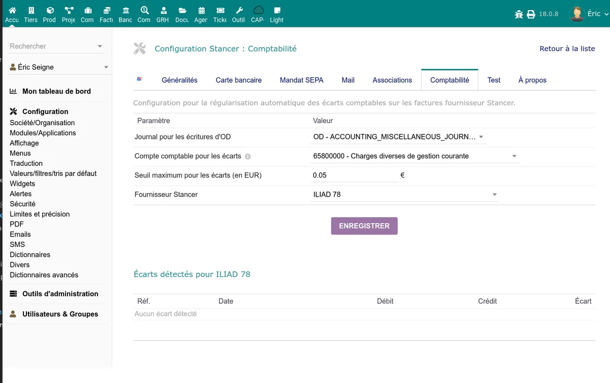

# Comptabilité

Le module Stancer intègre des outils de gestion comptable pour suivre les frais, détecter les écarts entre les montants Stancer et Dolibarr, et les régulariser. La configuration se fait dans l'onglet **Comptabilité** de la page d'administration.

## Enregistrement des frais

Le mode d'enregistrement des frais Stancer (commissions) est défini dans la [configuration générale](/stancer/configuration) (paramètre "Enregistrement des frais"). Trois modes sont disponibles :

- **Aucun** : les frais ne sont pas enregistrés dans les écritures bancaires.
- **Par reversement** : les frais sont enregistrés en une seule ligne lors de chaque reversement (payout). C'est le mode le plus courant.
- **Par paiement** : chaque paiement génère une écriture de frais individuelle sur le compte bancaire.

## Détection et régularisation des écarts

Des écarts peuvent apparaître entre les montants enregistrés dans Dolibarr et les montants réels chez Stancer, notamment à cause des arrondis ou de frais non comptabilisés. L'onglet Comptabilité fournit un outil pour les détecter et les régulariser.

### Configuration

| Paramètre | Description |
|-----------|-------------|
| Journal OD | Journal comptable utilisé pour les écritures de régularisation (opérations diverses) |
| Compte d'écart | Compte comptable pour enregistrer les écarts (par exemple : 658 -- Charges diverses de gestion courante) |
| Seuil d'écart | Montant minimum (en EUR) en dessous duquel les écarts ne sont pas signalés. Permet d'ignorer les écarts de centimes |
| Fournisseur Stancer | Fiche fournisseur Dolibarr correspondant à Stancer, utilisée pour la comptabilisation des frais |

> **Note :** le fournisseur Stancer doit avoir un compte auxiliaire fournisseur configuré pour que les écritures comptables soient correctement lettrées.

### Utilisation

La page de comptabilité affiche la liste des écarts détectés entre les reversements Stancer et les écritures bancaires Dolibarr.

Pour chaque écart :

1. Le module affiche le reversement concerné, le montant attendu et le montant enregistré.
2. Un bouton **Régulariser** permet de créer automatiquement une écriture d'OD (opération diverse) pour combler l'écart.
3. L'écriture est passée sur le compte d'écart configuré.

Si aucun écart n'est détecté, un message de confirmation est affiché.

## Transferts bancaires

Lors de la synchronisation des reversements, le module crée automatiquement des écritures de transfert entre le compte bancaire Stancer (compte de transit) et votre compte bancaire principal. Ces transferts apparaissent dans les relevés des deux comptes bancaires dans Dolibarr.

Le montant du transfert correspond au montant du reversement net (après déduction des frais, selon le mode d'enregistrement choisi).

## Import et vérification des reversements

La page **Import/vérification des reversements** (accessible depuis le menu) permet de :

- Comparer les reversements enregistrés dans Dolibarr avec les données de l'API Stancer
- Identifier les reversements manquants ou les montants incohérents
- Corriger les libellés et dates sur le compte bancaire principal
