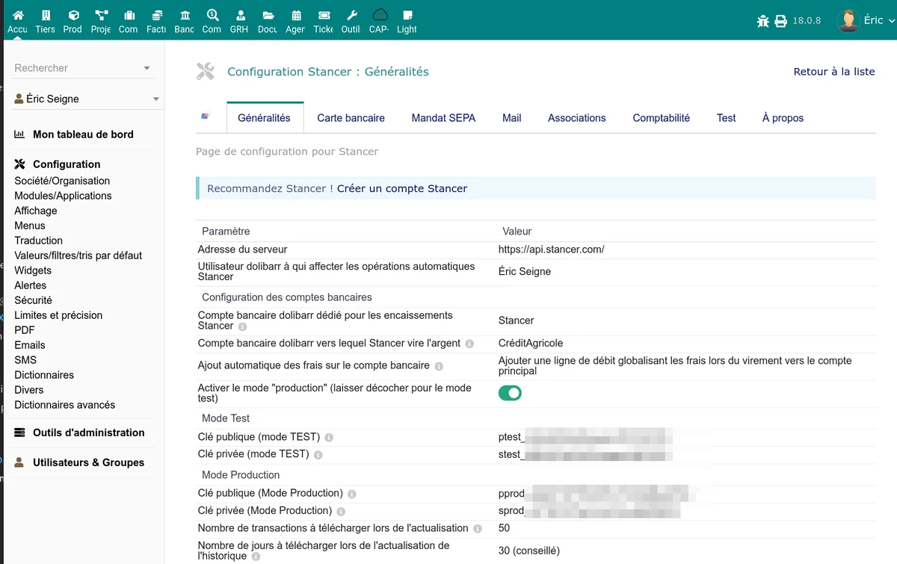
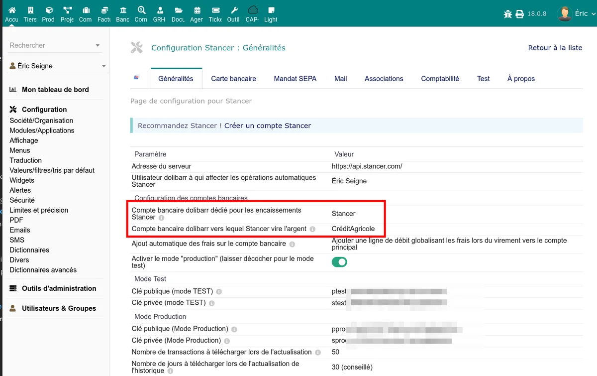

# Configuration

Après l'activation du module, rendez-vous dans **Accueil > Configuration > Modules > Stancer** (icône d'engrenage) pour accéder à la page de configuration. L'onglet **Généralités** contient les paramètres essentiels.

## Clés API

Stancer fournit deux jeux de clés API : un pour le mode test et un pour le mode production.

### Mode test

| Paramètre | Description |
|-----------|-------------|
| Clé publique de test | Clé commençant par `ptest_` -- utilisée côté client (page de paiement) |
| Clé privée de test | Clé commençant par `stest_` -- utilisée côté serveur (appels API) |

### Mode production

| Paramètre | Description |
|-----------|-------------|
| Clé publique de production | Clé commençant par `pprod_` |
| Clé privée de production | Clé commençant par `sprod_` |

Récupérez vos clés depuis votre [espace Stancer](https://manage.stancer.com/).

> **Attention :** ne confondez pas les clés publiques et privées. La clé privée ne doit jamais être exposée publiquement.

## Mode production / test

Le paramètre **Mode production** détermine quel jeu de clés API est utilisé :

- **Non** (par défaut) : mode test. Les paiements ne sont pas réels. Utilisez ce mode pour vos essais.
- **Oui** : mode production. Les paiements sont réels et encaissés.

> **Note :** en mode test, la liste des reversements n'est pas disponible (l'API Stancer ne fournit pas de données de reversement en mode test).

## Comptes bancaires

### Compte bancaire pour les encaissements

Sélectionnez le compte bancaire Dolibarr sur lequel les paiements reçus via Stancer seront enregistrés. Par défaut, le compte "STANCER" créé automatiquement à l'installation est proposé.

Ce compte sert de **compte de transit** : les fonds y sont enregistrés à la réception du paiement, avant d'être transférés vers votre compte bancaire principal lors du reversement.

### Compte bancaire principal pour les reversements

Sélectionnez votre compte bancaire principal (celui sur lequel Stancer effectue les virements de reversement). Lorsqu'un reversement est synchronisé, le module crée une écriture de transfert du compte Stancer vers ce compte.

## Enregistrement des frais

Le paramètre **Enregistrement des frais** contrôle comment les commissions Stancer sont comptabilisées :

| Option | Comportement |
|--------|-------------|
| Aucun | Les frais ne sont pas enregistrés sur le compte bancaire |
| Par reversement | Les frais sont enregistrés en une seule ligne lors de chaque reversement |
| Par paiement | Les frais sont enregistrés individuellement pour chaque paiement |

## Utilisateur pour les actions automatisées

Sélectionnez le compte utilisateur Dolibarr qui sera utilisé pour les opérations automatiques du module (classement de factures en payées, création d'écritures bancaires, envoi d'emails). Choisissez un utilisateur disposant des permissions nécessaires sur les factures et la banque.

## Paramètres de synchronisation

### Nombre de jours à synchroniser

Détermine la profondeur de l'historique récupéré lors d'une synchronisation avec l'API Stancer. Valeur par défaut : **31 jours**.

Valeurs disponibles : 10, 20, 30, 40, 50, 60, 90, 365 ou 730 jours.

> **Conseil :** une valeur de 30 à 60 jours suffit pour un usage courant. Augmentez-la uniquement si vous avez besoin de récupérer un historique plus ancien (première installation, rattrapage).

### Nombre d'éléments par synchronisation

Nombre maximum d'éléments récupérés par appel API. Valeur par défaut : **100**.

Valeurs disponibles : 10, 20, 30, 50 ou 100.

## Abonnement TPE mensuel

Ce champ informatif permet de saisir le montant de l'abonnement mensuel Stancer (par défaut : 18 EUR). Il est utilisé dans les calculs d'estimation de frais affichés dans le tableau de bord.

## Paiement depuis les devis

La section **Devis** permet de configurer le paiement en ligne directement depuis un devis (proposition commerciale) :

- **Créer automatiquement la facture quand un devis est payé** : si activé, le module génère automatiquement la facture correspondante lorsque le client paie un devis en ligne.

## Nettoyage des données de test

Lorsque vous passez du mode test au mode production, un bouton **Nettoyer les données de tests** apparaît. Il supprime les paiements, reversements et remboursements enregistrés en mode test pour repartir sur une base propre.

## Étapes suivantes

Une fois la configuration générale terminée, activez les moyens de paiement souhaités :

- [Paiements par carte bancaire](/stancer/paiements-cb)
- [Prélèvements SEPA](/stancer/sepa)
- [Notifications par email](/stancer/notifications)
