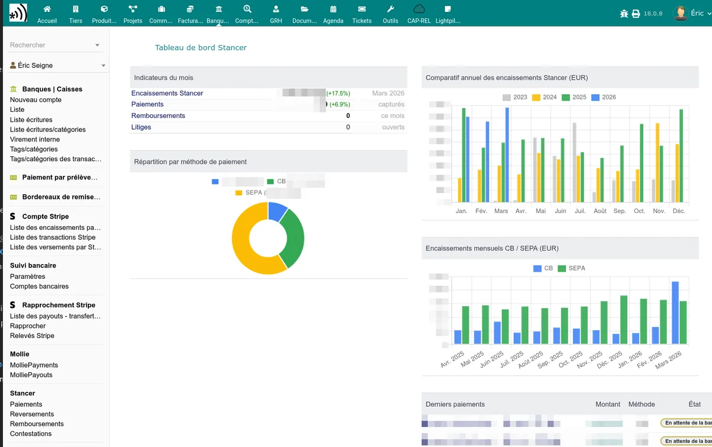

# Stancer pour Dolibarr

Le module Stancer intègre la plateforme de paiement [Stancer](https://www.stancer.com/) dans votre ERP Dolibarr. Il vous permet d'encaisser vos clients par **carte bancaire** et par **prélèvement SEPA**, directement depuis vos factures, commandes et devis.

## Fonctionnalités principales

**Paiements par carte bancaire**

- Envoi de liens de paiement en ligne à vos clients
- Page publique de paiement sécurisée (3D Secure)
- Paiement partiel depuis les commandes et devis
- Confirmation automatique et classement de la facture en payée

**Prélèvements SEPA**

- Page publique de saisie d'IBAN pour vos clients
- Création automatique du mandat SEPA (PDF)
- Vérification d'IBAN via SEPAMail (France et Italie)
- Prélèvement automatique des factures échues
- Gestion des rejets SEPA avec facturation automatique des frais
- Intégration optionnelle avec UptoSign pour la signature électronique du mandat

**Suivi et synchronisation**

- Tableau de bord avec indicateurs clés (chiffre d'affaires, paiements, remboursements, contestations)
- Listes de suivi : paiements, reversements, remboursements, contestations
- Synchronisation avec l'API Stancer (manuelle ou par tâche planifiée)
- Onglet Stancer sur la fiche de chaque tiers

**Notifications**

- Emails automatiques de confirmation de paiement
- Notifications d'erreur et de rejet SEPA au client et à l'administrateur
- Relances automatiques en cas d'échec de paiement

**Comptabilité**

- Enregistrement des frais Stancer sur le compte bancaire
- Détection et régularisation des écarts comptables
- Gestion des reversements (payouts)

**Associations**

- Paiement des cotisations et dons en ligne

## Prérequis

- **Dolibarr** version 15.0 ou supérieure
- **PHP** version 7.4 ou supérieure
- Un **compte Stancer** avec vos clés API (inscription sur [stancer.com](https://www.stancer.com/))
- Les modules **Banque** et **Prélèvements** activés dans Dolibarr

## Premiers pas

1. [Installez le module](/stancer/installation)
2. [Configurez vos clés API et votre compte bancaire](/stancer/configuration)
3. [Activez les paiements par carte bancaire](/stancer/paiements-cb) et/ou [les prélèvements SEPA](/stancer/sepa)
4. [Suivez vos paiements](/stancer/suivi-paiements)
