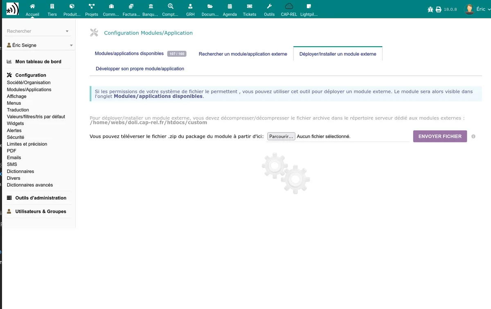

# Installation

## Téléchargement

Téléchargez le module depuis sa fiche sur le DoliStore. Vous obtenez une archive `.zip` contenant le module Stancer.

## Installation

1. Connectez-vous à Dolibarr avec un compte administrateur.
2. Rendez-vous dans **Accueil > Configuration > Modules/Applications**.
3. Cliquez sur **Déployer/Installer un module externe**.
4. Sélectionnez l'archive `.zip` téléchargée et validez.

Dolibarr extrait automatiquement les fichiers dans le répertoire des modules personnalisés.

## Activation

1. Restez dans **Accueil > Configuration > Modules/Applications**.
2. Recherchez "Stancer" dans la liste des modules (catégorie **Interfaces**).
3. Cliquez sur l'interrupteur pour activer le module.

## Vérifications post-installation

Lors de l'activation, le module effectue automatiquement plusieurs opérations :

- **Création des tables** en base de données pour stocker les paiements, reversements et remboursements.
- **Création d'un compte bancaire "STANCER"** qui servira de compte de transit pour les paiements reçus.
- **Génération d'un jeton de sécurité** pour les pages publiques de paiement (si aucun n'existe).

Vérifiez que ces éléments sont en place :

1. Rendez-vous dans **Banque > Comptes bancaires** et confirmez la présence du compte "STANCER".
2. Cliquez sur l'icône d'engrenage à côté du module pour accéder à la [configuration](/stancer/configuration).

## Modules requis

Le module Stancer nécessite l'activation préalable de deux modules Dolibarr :

- **Banque** -- gestion des comptes bancaires et écritures
- **Prélèvements** -- support des ordres de prélèvement SEPA

Si ces modules ne sont pas activés, le module Stancer ne pourra pas être activé.

## Permissions

Le module ajoute deux permissions à configurer dans **Accueil > Configuration > Utilisateurs > Permissions** :

| Permission | Description |
|-----------|-------------|
| Lire les données Stancer | Accès en lecture aux listes de paiements, reversements, remboursements et contestations |
| Créer/modifier les données Stancer | Accès aux actions : rafraîchissement, remboursement, gestion des mandats SEPA |

Attribuez ces permissions aux utilisateurs ou groupes concernés.

## Mise à jour

Pour mettre à jour le module :

1. Téléchargez la nouvelle version depuis le DoliStore.
2. Installez-la via **Accueil > Configuration > Modules/Applications > Déployer/Installer un module externe**.
3. Désactivez puis réactivez le module pour appliquer les mises à jour de base de données et enregistrer les nouveaux hooks et permissions.

> **Attention :** sauvegardez votre base de données avant toute mise à jour.

## Désinstallation

Pour désinstaller le module :

1. Rendez-vous dans **Accueil > Configuration > Modules/Applications**.
2. Désactivez le module Stancer en cliquant sur l'interrupteur.

La désactivation conserve les données en base. Le compte bancaire "STANCER" et les écritures associées ne sont pas supprimés.
