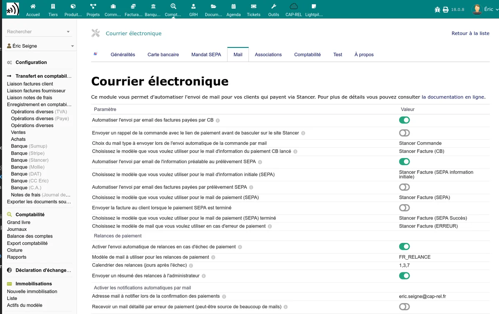

# Notifications email

Le module Stancer peut envoyer des emails automatiques à vos clients et à vos administrateurs selon les événements de paiement. La configuration se fait dans l'onglet **Mail** de la page d'administration.

## Notifications administrateur

### Notifications de paiement et reversement

| Option | Description |
|--------|-------------|
| Notifications automatiques | Active l'envoi global d'emails de notification |
| Notification de paiement | Email envoyé à l'administrateur à chaque paiement reçu |
| Notification de reversement | Email envoyé à l'administrateur à chaque reversement effectué |

Saisissez l'adresse email de destination pour ces notifications. Vous pouvez indiquer plusieurs adresses séparées par des virgules.

## Emails aux clients -- Carte bancaire

### Confirmation de paiement CB

Lorsqu'un client paie par carte bancaire, le module peut automatiquement lui envoyer un email de confirmation. Deux options sont proposées :

| Option | Description |
|--------|-------------|
| Envoi automatique de la facture par email | Envoie la facture PDF au client après un paiement CB réussi |
| Modèle d'email | Modèle Dolibarr utilisé pour l'envoi de la facture (configurable dans les modèles d'emails de Dolibarr) |

### Confirmation de paiement CB sur commande

De la même manière, pour les paiements effectués sur une commande :

| Option | Description |
|--------|-------------|
| Envoi automatique après paiement de commande | Envoie un email de confirmation au client |
| Modèle d'email de commande | Modèle Dolibarr utilisé pour l'envoi |

## Emails aux clients -- SEPA

Plusieurs emails sont configurables pour le cycle de vie SEPA :

| Option | Description |
|--------|-------------|
| Email d'information SEPA | Email envoyé au client pour l'informer d'un prélèvement à venir (notification préalable) |
| Email de prélèvement SEPA | Email envoyé au client lors de l'émission du prélèvement |
| Email SEPA payé | Email envoyé au client après encaissement confirmé du prélèvement |

## Notification d'erreur

| Option | Description |
|--------|-------------|
| Email d'erreur de paiement | Email envoyé au client et/ou à l'administrateur en cas d'échec de paiement |

## Emails de rejet SEPA

Lorsqu'un prélèvement SEPA est rejeté, le module envoie automatiquement un email au client (si configuré dans l'onglet SEPA) et à l'adresse configurée dans le champ **Email de notification SEPA**.

L'email de rejet contient :

- La référence de la facture concernée
- Le montant du prélèvement rejeté
- Le motif du rejet (code ISO 20022 traduit en langage clair)
- Les éventuels frais de rejet facturés

## Envoi automatique des factures à la validation

Le module peut envoyer la facture par email au client dès sa validation, quel que soit le mode de paiement (chèque, virement, espèces, CB, SEPA...). Un délai de carence est paramétrable pour laisser à un humain le temps d'envoyer la facture manuellement avec un message d'accompagnement, avant que l'envoi automatique ne se déclenche.

| Paramètre | Description |
|-----------|-------------|
| Envoyer la facture par mail à la validation | Active l'envoi automatique à chaque validation |
| Modèle d'email | Modèle Dolibarr utilisé pour l'envoi |
| Délai avant envoi automatique (en heures) | Nombre d'heures à attendre après la validation. 0 = envoi immédiat. Valeur typique : 24 (envoi le lendemain si personne n'a rien fait) |

Fonctionnement avec un délai > 0 :

- À la validation de la facture, le module enregistre un envoi programmé (visible dans le tableau de bord Stancer).
- Pendant le délai, vous pouvez envoyer la facture manuellement avec votre propre message : l'envoi automatique sera annulé.
- Si la facture est repassée en brouillon, supprimée ou abandonnée pendant le délai, l'envoi automatique est également annulé.
- Si rien n'est fait, l'envoi automatique est déclenché par la [tâche planifiée](/stancer/taches-automatiques) dédiée (exécutée toutes les heures).

> **Astuce :** une vue "Envois de factures programmés" est disponible dans le tableau de bord Stancer pour suivre les factures dont l'envoi est encore en attente. Les échéances dépassées y apparaissent en rouge.

## Relances automatiques

Le module peut envoyer des relances automatiques aux clients dont le paiement a échoué (statuts `failed`, `refused`, `expired`, `disputed`). Le système gère trois niveaux de relances paramétrables :

- **Relance souple** (par défaut J+7) -- premier rappel après l'échec
- **Relance ferme** (par défaut J+14) -- deuxième rappel
- **Relances mensuelles** -- envoyées tous les 30 jours environ, jusqu'à 6 mois après l'échec

| Paramètre | Description |
|-----------|-------------|
| Activer les relances | Active l'envoi automatique de relances |
| Modèle de mail par défaut | Modèle utilisé en repli si aucun modèle spécifique n'est configuré pour un niveau |
| Modèle pour la 1re relance (souple) | Modèle utilisé pour la première relance (par défaut J+7). Si vide, le modèle par défaut est utilisé |
| Modèle pour la 2e relance (ferme) | Modèle utilisé pour la deuxième relance (par défaut J+14). Si vide, le modèle par défaut est utilisé |
| Modèle pour les relances mensuelles | Modèle utilisé pour les relances suivantes (mensuelles, jusqu'à 6 mois). Si vide, le modèle par défaut est utilisé |
| Calendrier de relance | Liste séparée par des virgules des jours après l'échec pour chaque relance. Par défaut : `7,14,44,74,104,134,164` (J+7 souple, J+14 ferme, puis mensuel jusqu'à environ 6 mois) |
| Résumé administrateur | Envoie un récapitulatif des relances envoyées à l'administrateur |

Le niveau (souple, ferme, mensuel) est déterminé automatiquement à partir du rang de la relance dans le calendrier : la première relance est de type souple, la deuxième de type ferme, et toutes les suivantes de type mensuel. Le rang dépend uniquement de la position dans la liste, pas du nombre de jours configurés.

> **Réouverture automatique de la facture :** dès qu'un paiement est détecté comme échoué (`failed`, `refused`, `expired`, `disputed`), si la facture avait été marquée payée, elle est automatiquement rouverte par le module et un paiement inverse est créé pour rétablir le reste à payer. Une trace est ajoutée dans l'historique des événements de la facture.

Les relances sont exécutées par la [tâche planifiée](/stancer/taches-automatiques) dédiée.

## Variables disponibles dans les emails

Les modèles d'emails Stancer utilisent les variables de substitution standard de Dolibarr, plus quelques variables spécifiques :

- `__AMOUNT__` : montant du paiement
- `__PAYMENT_ID__` : identifiant Stancer du paiement
- `__INVOICE_REF__` : référence de la facture
- `__ORDER_REF__` : référence de la commande
- `__CUSTOMER_NAME__` : nom du client

> **Conseil :** configurez vos modèles d'emails dans **Accueil > Configuration > Emails > Modèles d'emails** pour personnaliser le contenu des messages envoyés par le module.

## Copie cachée (BCC) pour archivage

Tous les emails envoyés par le module Stancer (notifications administrateur, mails clients, relances, récapitulatifs) respectent la configuration globale Dolibarr **Copie cachée pour tous les emails sortants**.

Pour archiver une copie de chaque email à une adresse dédiée :

1. Allez dans **Accueil > Configuration > Emails**.
2. Renseignez le champ **Adresses en copie cachée pour tous les emails sortants** (clé `MAIN_MAIL_AUTOCOPY_TO`) avec votre adresse d'archivage.
3. Sauvegardez.

L'ajout en copie cachée est automatique sur tous les emails du module, vous n'avez rien à configurer côté Stancer.

## Notification "Transfert bancaire terminé"

Lorsqu'un transfert (payout) est synchronisé depuis Stancer, un email "Transfert bancaire terminé" est envoyé à l'adresse de notification administrateur. **Cet email n'est envoyé qu'une seule fois par payout**, même si la tâche planifiée de synchronisation s'exécute tous les jours et retombe sur le même payout dans la fenêtre des 31 derniers jours.

Le module trace l'envoi via un événement (ActionComm) rattaché au compte bancaire de destination, ce qui empêche les doublons.
