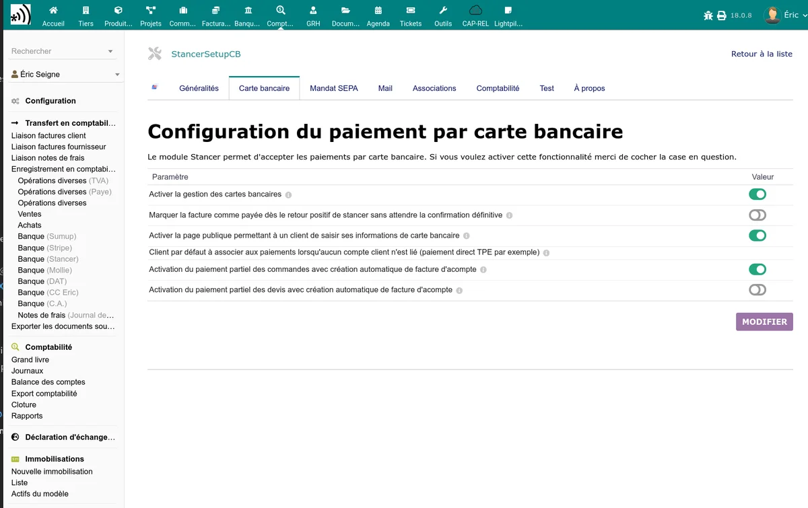

# Paiements par carte bancaire

Le module Stancer permet à vos clients de payer par carte bancaire depuis un lien de paiement en ligne sécurisé. La configuration se fait dans l'onglet **Carte bancaire** de la page d'administration du module.

## Activation

Activez l'option **Activer le paiement par carte bancaire** pour rendre disponible ce moyen de paiement. Une fois activé, des boutons de paiement CB apparaissent sur les fiches de factures, commandes et devis.

## Page publique de paiement

L'option **Activer la page publique de paiement CB** crée une page accessible sans connexion à Dolibarr. Vos clients y accèdent via un lien sécurisé contenant un jeton unique.

Le parcours de paiement est le suivant :

1. Le client reçoit un lien de paiement (par email ou depuis le document PDF).
2. Il est redirigé vers la page de paiement Stancer (hébergée par Stancer, sécurisée 3D Secure).
3. Il saisit ses informations de carte et valide.
4. Il est redirigé vers une page de confirmation dans Dolibarr.
5. La facture est automatiquement classée en payée.

## Paiement partiel

Deux options permettent d'autoriser le paiement d'un montant inférieur au total :

| Option | Description |
|--------|-------------|
| Paiement partiel depuis les commandes | Permet au client de payer un montant partiel sur une commande |
| Paiement partiel depuis les devis | Permet au client de payer un montant partiel sur un devis (acompte) |

Lorsque le paiement partiel est activé, le client peut modifier le montant proposé sur la page de paiement.

## Classement automatique en payé

L'option **Classer la facture en payée après paiement CB** détermine le comportement après réception d'un paiement CB réussi :

- **Activé** : la facture est automatiquement classée en "Payée" si le montant reçu couvre le solde restant.
- **Désactivé** : le paiement est enregistré mais la facture reste en statut "Commencée". Vous devrez la classer manuellement.

## Enregistrement de carte bancaire

L'onglet Stancer sur la fiche d'un tiers permet d'enregistrer une carte bancaire pour un client. Cette carte pourra être utilisée pour les paiements ultérieurs sans que le client ait à ressaisir ses informations.

Les informations affichées pour une carte enregistrée sont :

- Type de carte (Visa, Mastercard, etc.)
- Quatre derniers chiffres
- Date d'expiration

### Affichage sur l'onglet "Modes de paiement" standard

Les cartes bancaires enregistrées via Stancer apparaissent aussi en bas de l'onglet **Modes de paiement** standard de Dolibarr (page accessible depuis la fiche tiers, en plus de l'onglet Stancer dédié). Cet affichage est fourni par le module Stancer lui-même et fonctionne sur toutes les versions de Dolibarr à partir de la 18, y compris 22 et 23. Le tableau "Cartes bancaires Stancer enregistrées" liste pour chaque carte :

- le libellé interne (par exemple `stancer-card` ou `stancer-card-tst` en mode test) ;
- la référence Stancer de la carte (avec un lien direct vers le tableau de bord [manage.stancer.com](https://manage.stancer.com)) ;
- la marque (Visa, Mastercard, etc.) ;
- le titulaire, les quatre derniers chiffres et la date d'expiration ;
- l'indicateur "Par défaut" si la carte est celle utilisée par défaut pour ce client ;
- la date de dernière modification.

La gestion des cartes (ajout, suppression, désignation par défaut) reste pilotée depuis l'onglet Stancer dédié et depuis le tableau de bord Stancer. L'onglet "Modes de paiement" se contente d'afficher l'état courant.

## Paiement depuis un devis

Lorsque le paiement CB est activé, un bouton de paiement apparaît également sur les devis (propositions commerciales). Le workflow est :

1. Vous créez et validez un devis.
2. Un lien de paiement est disponible sur la fiche du devis.
3. Le client paie en ligne.
4. Si l'option est activée dans la [configuration générale](/stancer/configuration), la facture est créée automatiquement depuis le devis.

> **Note :** pour que le lien de paiement apparaisse sur un devis, le client doit avoir une adresse email renseignée dans sa fiche tiers.

## Paiement depuis une commande

Le même mécanisme fonctionne pour les commandes :

1. Vous créez et validez une commande.
2. Le bouton de paiement Stancer apparaît sur la fiche de la commande.
3. Le client paie via le lien sécurisé.
4. Le paiement est enregistré et lié à la facture correspondante.

## Bouton de paiement sur les documents

Le module peut ajouter un bouton ou un message de paiement sur vos factures PDF et autres documents. Les paramètres correspondants sont configurables dans l'onglet Carte bancaire :

- **Bouton de paiement** : texte affiché sur le bouton
- **Message de paiement** : texte complémentaire affiché à côté du bouton
- **Texte pour les acomptes** : texte spécifique pour les paiements d'acompte
