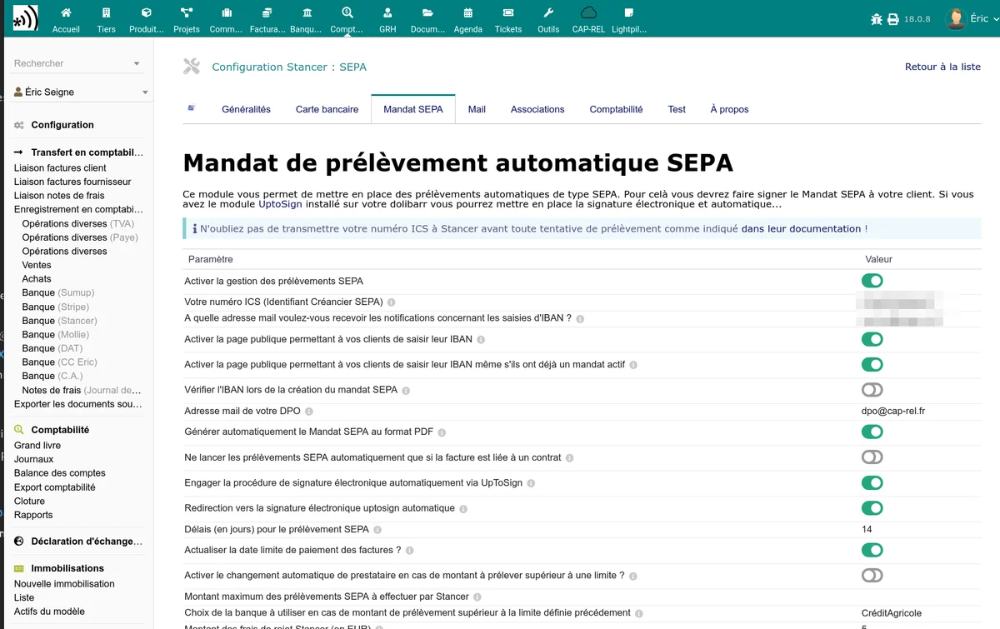
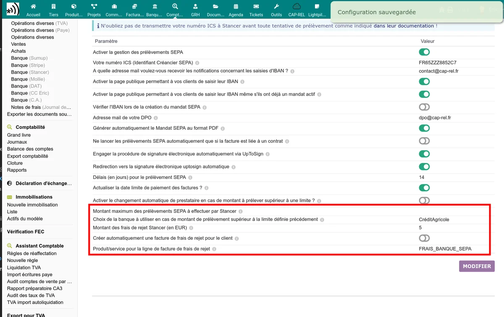

# Prélèvements SEPA

Le module Stancer permet de prélever automatiquement vos clients par prélèvement SEPA. La configuration se fait dans l'onglet **Mandat SEPA** de la page d'administration.

## Activation

Activez l'option **Activer le prélèvement SEPA** pour rendre disponible ce moyen de paiement.

## Identifiant Créancier SEPA (ICS)

Le champ **ICS** (Identifiant Créancier SEPA) est obligatoire pour émettre des prélèvements. Cet identifiant est attribué par votre banque. Sans ICS, le module affiche un avertissement et les prélèvements ne peuvent pas être émis.

## Page publique de saisie d'IBAN

L'option **Activer la page publique IBAN** crée une page accessible sans connexion où vos clients peuvent saisir leur IBAN pour mettre en place un mandat SEPA.

| Option | Description |
|--------|-------------|
| Page publique IBAN | Active la page de saisie d'IBAN pour les clients |
| Forcer la page publique IBAN | Redirige automatiquement les clients vers cette page si aucun mandat SEPA n'est en place |

Le parcours client est le suivant :

1. Le client accède au lien de saisie d'IBAN (envoyé par email ou accessible depuis l'onglet Stancer du tiers).
2. Il saisit son IBAN, son BIC et le nom du titulaire du compte.
3. Le module vérifie la validité de l'IBAN.
4. Le mandat SEPA est créé sur la plateforme Stancer.
5. Un PDF de mandat est généré automatiquement (si l'option est activée).

## Vérification d'IBAN (SEPAMail)

L'option **Vérification IBAN via SEPAMail** permet de vérifier que le compte bancaire du client est bien atteignable pour un prélèvement SEPA. Cette vérification est disponible uniquement pour les IBAN français et italiens.

Les résultats possibles sont :

| Résultat | Signification |
|----------|--------------|
| Succès | Le compte est atteignable et le prélèvement sera possible |
| Avertissement | Le compte existe mais un problème potentiel a été détecté |
| En attente | La vérification est en cours (la réponse de la banque n'est pas encore arrivée) |
| Non vérifiable | Le type d'IBAN n'est pas couvert par SEPAMail |
| Erreur | Le compte n'est pas atteignable ou l'IBAN est invalide |
| Compte non joignable | La banque n'a pas pu être contactée via SEPAMail |

## Génération automatique du mandat PDF

L'option **Génération automatique du mandat** crée un document PDF de mandat SEPA lorsqu'un client enregistre son IBAN. Ce PDF est attaché à la fiche du tiers et peut être envoyé pour signature.

## Signature électronique avec UptoSign

Si le module UptoSign est installé et activé dans votre Dolibarr, deux options supplémentaires apparaissent :

| Option | Description |
|--------|-------------|
| Envoi automatique pour signature | Le mandat PDF est envoyé automatiquement à UptoSign pour signature électronique |
| Sans clic | Le client est redirigé directement vers la page de signature sans étape intermédiaire |

> **Note :** la signature électronique par UptoSign nécessite que le mandat ait un seul signataire. Si plusieurs signataires sont détectés, un avertissement est affiché.

## Email de notification IBAN

Le champ **Email de notification IBAN** permet de recevoir un email à chaque fois qu'un client enregistre un nouvel IBAN. Saisissez l'adresse email qui recevra ces notifications.

## Email du DPO

Le champ **Email du DPO** (Délégué à la Protection des Données) est affiché dans le texte légal du mandat SEPA. Ce champ est obligatoire pour la conformité RGPD du formulaire de mandat.

## Délai de notification SEPA

Le paramètre **Délai de notification** (en jours) définit combien de jours avant le prélèvement le client est notifié. La réglementation française impose un délai minimum de **14 jours**.

L'option **Mettre à jour les factures** associée permet de reporter la date de prélèvement effective sur les factures concernées.

## Restriction aux contrats

L'option **Prélèvement uniquement pour les clients sous contrat** limite le prélèvement automatique SEPA aux clients ayant un contrat actif dans Dolibarr.

## Basculement CB / SEPA par montant

Le module peut automatiquement basculer vers le prélèvement SEPA au-delà d'un certain montant :

| Paramètre | Description |
|-----------|-------------|
| Montant de basculement | Seuil au-dessus duquel le paiement passe en SEPA au lieu de CB |
| Montant maximum SEPA | Plafond au-delà duquel le prélèvement SEPA n'est pas proposé |
| Compte bancaire alternatif | Compte bancaire à utiliser pour les prélèvements SEPA au-dessus du seuil |

## Frais de rejet SEPA

Lorsqu'un prélèvement SEPA est rejeté par la banque du client, le module peut automatiquement facturer des frais de rejet.

| Paramètre | Description |
|-----------|-------------|
| Montant des frais de rejet | Montant facturé au client en cas de rejet (en EUR) |
| Facturation automatique | Si activé, une facture de frais est créée automatiquement lors de la détection du rejet |
| Produit/service pour les frais | Produit ou service Dolibarr utilisé comme ligne de la facture de frais |

Lorsqu'un rejet est détecté :

1. La facture d'origine est rouverte (remise en statut "Impayée").
2. Si la facturation automatique est activée, une facture de frais de rejet est créée.
3. Un email de notification est envoyé au client et à l'administrateur.

> **Important :** la facture de frais de rejet est configurée pour ne **pas** être prélevée automatiquement en SEPA, afin d'éviter une boucle de rejet.

### Codes de rejet SEPA

Le module identifie la raison du rejet grâce aux codes ISO 20022. Les codes les plus courants sont :

| Code | Signification |
|------|--------------|
| AC01 | Numéro de compte incorrect (IBAN erroné) |
| AC04 | Compte clôturé |
| AC06 | Compte bloqué |
| AG01 | Opération interdite sur ce type de compte |
| AM04 | Provision insuffisante |
| MD01 | Pas de mandat valide |
| MD06 | Contestation du débiteur (remboursement demandé) |
| MS02 | Motif non spécifié par le client |
| MS03 | Motif non spécifié par la banque |
| RC01 | BIC invalide |
| SL01 | Service spécifique demandé par le débiteur (opposition) |

Le détail du code de rejet est affiché dans la liste des paiements et dans les notifications email.

## Gestion des mandats depuis la fiche tiers

L'onglet Stancer sur la fiche d'un tiers affiche les mandats SEPA en cours et permet de :

- Voir l'IBAN enregistré (partiellement masqué)
- Copier le lien public de saisie d'IBAN pour l'envoyer au client
- Supprimer un mandat SEPA

