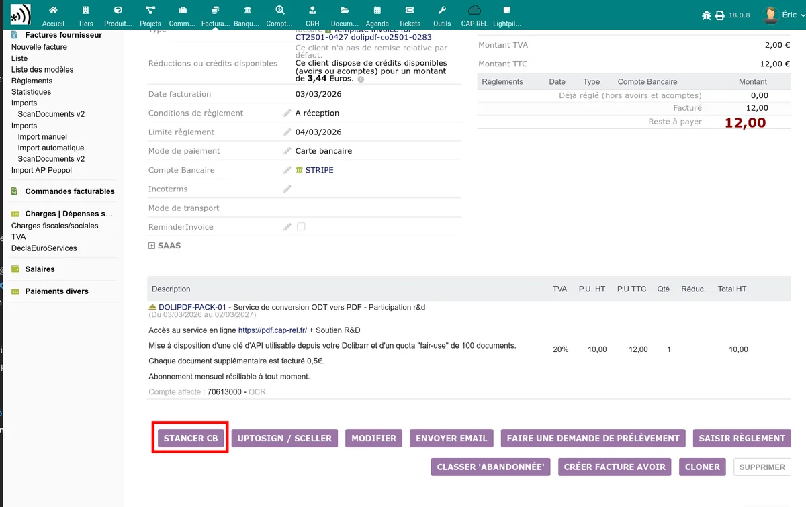

# Suivi des paiements

Le module Stancer ajoute un menu **Stancer** dans la section **Banque** du menu latéral gauche. Ce menu donne accès à quatre listes de suivi et à un tableau de bord.

## Tableau de bord

La page d'accueil du module affiche un tableau de bord avec les indicateurs clés :

- **Chiffre d'affaires** du mois en cours
- **Nombre de paiements** capturés
- **Remboursements** en cours
- **Contestations** ouvertes
- **Répartition par méthode** de paiement (CB / SEPA)
- **Comparaison annuelle** des encaissements
- **Alertes** (contestations et remboursements récents)
- **Derniers paiements** reçus

> **Note :** en mode test, un bandeau d'avertissement rappelle que les données affichées sont des données de test.

## Liste des paiements

Accessible via **Banque > Stancer > Paiements**.

Cette liste affiche tous les paiements enregistrés localement, synchronisés depuis l'API Stancer. Seuls les paiements correspondant au mode actuel (test ou production) sont affichés.

### Colonnes affichées

| Colonne | Description |
|---------|-------------|
| Réf. | Identifiant Stancer du paiement (`paym_xxx`) |
| Date | Date du paiement |
| Montant | Montant du paiement en euros |
| Frais | Commission Stancer sur ce paiement |
| Statut | Statut du paiement (voir ci-dessous) |
| Code réponse | Code de réponse bancaire (pour les rejets) |
| Facture / Commande | Lien vers la facture ou commande Dolibarr associée |
| Tiers | Nom du client |

### Statuts des paiements

| Statut | Signification |
|--------|--------------|
| Capturé | Paiement encaissé avec succès |
| Autorisé | Paiement autorisé, en attente de capture |
| Capture envoyée | Demande de capture envoyée à la banque |
| À capturer | Paiement en attente de capture manuelle |
| Contesté | Paiement contesté par le client |
| Expiré | Autorisation expirée sans capture |
| Échoué | Paiement échoué (erreur technique) |
| Refusé | Paiement refusé par la banque |

### Bouton Rafraîchir

Le bouton **Rafraîchir** en haut de la liste déclenche une synchronisation avec l'API Stancer :

1. Récupération des nouveaux paiements depuis l'API.
2. Vérification du statut des paiements locaux en attente.
3. Suppression des brouillons de paiement obsolètes.

> **Important :** la synchronisation est déclenchée uniquement par ce bouton ou par les [tâches planifiées](/stancer/taches-automatiques). La navigation et le filtrage de la liste ne provoquent aucun appel API.

## Liste des reversements

Accessible via **Banque > Stancer > Reversements**.

Un reversement (payout) correspond au virement effectué par Stancer vers votre compte bancaire. Il regroupe les paiements encaissés sur une période donnée, moins les commissions.

### Colonnes affichées

| Colonne | Description |
|---------|-------------|
| Réf. | Identifiant Stancer du reversement |
| Date | Date du virement |
| Montant | Montant viré sur votre compte bancaire |
| Statut | Statut du reversement |

Le bouton **Rafraîchir** synchronise les reversements depuis l'API et crée les écritures de transfert bancaire correspondantes dans Dolibarr (du compte Stancer vers votre compte principal).

> **Note :** les reversements ne sont pas disponibles en mode test.

## Liste des remboursements

Accessible via **Banque > Stancer > Remboursements**.

Cette liste affiche les remboursements effectués depuis Stancer vers vos clients.

Lorsqu'un remboursement est confirmé, le module :

1. Rouvre la facture associée (passage en statut "Impayée").
2. Envoie une notification à l'administrateur.

### Créer un remboursement

Depuis la fiche d'un paiement capturé, vous pouvez initier un remboursement :

1. Ouvrez le paiement dans la liste.
2. Cliquez sur **Rembourser**.
3. Saisissez le montant à rembourser (total ou partiel).
4. Confirmez.

Le remboursement est envoyé à l'API Stancer et apparaîtra dans la liste après synchronisation.

## Liste des contestations

Accessible via **Banque > Stancer > Contestations**.

Une contestation (dispute) survient lorsqu'un client conteste un paiement auprès de sa banque.

Lorsqu'une contestation est perdue (statuts : perdue, acceptée, hors délai, non contestable), le module :

1. Rouvre la facture associée (passage en statut "Impayée").
2. Envoie un email de notification à l'administrateur et au client.
3. Crée une facture de frais de rejet si l'option est configurée (voir [Prélèvements SEPA](/stancer/sepa)).

Le bouton **Rafraîchir** synchronise les contestations depuis l'API Stancer.

## Onglet Stancer sur la fiche tiers

Chaque fiche tiers dispose d'un onglet **Stancer** qui centralise les informations de paiement du client :

- **Compte client Stancer** : identifiant du client chez Stancer
- **Cartes bancaires** enregistrées (type, derniers chiffres, expiration)
- **Mandats SEPA** en cours (IBAN partiellement masqué)
- **Liens publics** : URL de la page de saisie d'IBAN et de la page d'enregistrement CB

Depuis cet onglet, vous pouvez :

- Créer ou lier un compte client Stancer
- Enregistrer une carte bancaire
- Enregistrer un mandat SEPA
- Supprimer un mandat SEPA
- Copier les liens publics pour les envoyer au client

## Boutons de paiement sur les fiches

Le module ajoute des boutons d'action sur les fiches de plusieurs objets Dolibarr :

- **Facture** : bouton pour lancer un paiement CB ou SEPA
- **Commande** : bouton pour envoyer un lien de paiement
- **Devis** : bouton pour envoyer un lien de paiement (si configuré)

Ces boutons sont visibles par les utilisateurs disposant de la permission "Créer/modifier les données Stancer".

