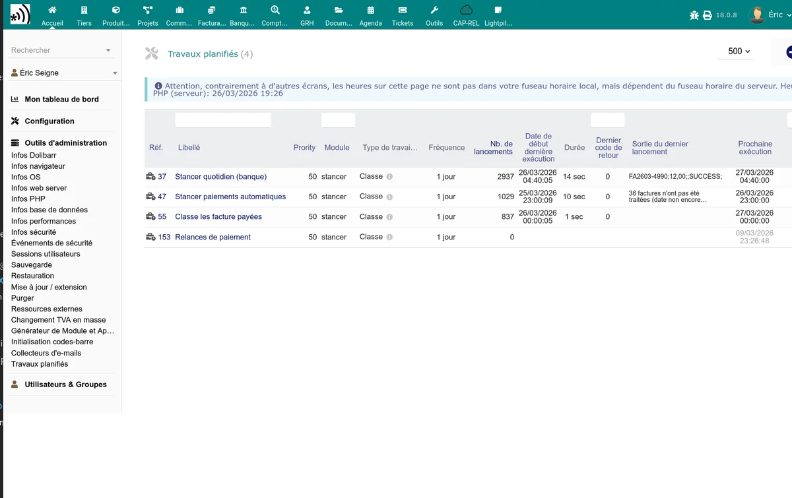

# Tâches automatiques

Le module Stancer enregistre cinq tâches planifiées dans le gestionnaire de tâches cron de Dolibarr. Par défaut, elles sont toutes **désactivées** et doivent être activées manuellement.

Accédez aux tâches planifiées dans **Accueil > Configuration > Tâches planifiées** et recherchez les tâches commençant par "Stancer".

## Synchronisation des paiements et reversements

**Nom de la tâche** : StancerCheckPay

Cette tâche effectue la même opération que le bouton "Rafraîchir" des listes de paiements et de reversements :

1. Récupère les nouveaux paiements depuis l'API Stancer.
2. Vérifie le statut des paiements locaux en attente.
3. Récupère les nouveaux reversements.
4. Supprime les brouillons de paiement obsolètes.

**Fréquence recommandée** : quotidienne (une fois par jour). La tâche est configurée par défaut pour s'exécuter à une heure aléatoire entre 0h et 6h.

> **Conseil :** si vous traitez un volume important de paiements, vous pouvez augmenter la fréquence à plusieurs fois par jour. Pour un usage modéré, une exécution quotidienne suffit.

## Prélèvement automatique des factures

**Nom de la tâche** : StancerCheckTakePayments

Cette tâche recherche les factures échues non payées et lance automatiquement le prélèvement (CB ou SEPA) pour les clients ayant un moyen de paiement enregistré.

Le processus est le suivant :

1. Recherche des factures impayées dont la date d'échéance est dépassée.
2. Pour chaque facture, vérifie si le client a une carte bancaire ou un mandat SEPA actif.
3. Lance le paiement via l'API Stancer.
4. Enregistre le résultat (succès ou erreur).

**Fréquence recommandée** : quotidienne.

> **Important :** cette tâche respecte les paramètres de configuration SEPA (délai de notification, restriction aux contrats, montant de basculement CB/SEPA). Vérifiez votre [configuration SEPA](/stancer/sepa) avant de l'activer.

## Vérification des factures payées

**Nom de la tâche** : StancerCheckInvoicesPaid

Cette tâche vérifie les paiements récents et classe les factures correspondantes en "Payée" si le montant total a été encaissé. Elle sert de filet de sécurité pour les factures qui n'auraient pas été classées automatiquement lors de la réception du paiement.

**Fréquence recommandée** : quotidienne.

## Envoi des relances

**Nom de la tâche** : StancerSendPaymentReminders

Cette tâche envoie des emails de relance aux clients dont le paiement a échoué, selon le calendrier et les modèles (souple, ferme, mensuel) définis dans la [configuration des notifications](/stancer/notifications). Elle parcourt les paiements en échec datant de moins de 6 mois et choisit automatiquement le bon modèle d'email selon le rang de la relance.

**Fréquence recommandée** : quotidienne.

> **Note :** les relances ne sont envoyées que si l'option est activée dans l'onglet Mail de la configuration. Un résumé des relances envoyées peut être adressé à l'administrateur si l'option est cochée.

## Envoi automatique des factures à la validation (différé)

**Nom de la tâche** : StancerSendPendingValidationMails

Cette tâche envoie automatiquement par email les factures validées dont le délai de carence est dépassé, sauf si elles ont été envoyées manuellement entre-temps. Elle ne fait rien si l'option **Envoyer la facture par mail à la validation** n'est pas activée ou si le délai est à 0 (envoi immédiat sans différé).

À chaque exécution, la tâche :

1. Recherche les envois programmés dont l'échéance est passée.
2. Annule l'envoi si la facture n'est plus validée (brouillon, abandonnée, supprimée).
3. Annule l'envoi si la facture a été envoyée manuellement après la programmation.
4. Sinon, envoie le mail au client via le modèle configuré et marque l'envoi comme terminé.

**Fréquence recommandée** : horaire (par défaut).

> **Note :** la liste des envois en attente est visible dans le tableau de bord Stancer.

## Activation et configuration

Pour activer une tâche planifiée :

1. Rendez-vous dans **Accueil > Configuration > Tâches planifiées**.
2. Cliquez sur la tâche Stancer à activer.
3. Passez le statut à **Activé**.
4. Configurez la fréquence d'exécution souhaitée.
5. Sauvegardez.

> **Prérequis :** le cron Dolibarr doit être configuré sur votre serveur pour que les tâches planifiées s'exécutent. Consultez la documentation Dolibarr pour la configuration du cron système.

## Ordre d'exécution

Les tâches s'exécutent indépendamment, mais l'ordre logique recommandé est :

1. **StancerCheckPay** (synchronisation) -- pour avoir des données à jour
2. **StancerCheckTakePayments** (prélèvement) -- pour lancer les paiements
3. **StancerCheckInvoicesPaid** (vérification) -- pour classer les factures payées
4. **StancerSendPaymentReminders** (relances) -- pour relancer les échecs
5. **StancerSendPendingValidationMails** (envoi différé à la validation) -- pour envoyer les factures dont le délai de carence est dépassé

En cas d'erreur lors de la synchronisation (par exemple, erreur d'authentification API), les tâches suivantes dans la chaîne ne sont pas bloquées car elles sont indépendantes. Chaque tâche gère ses propres erreurs et les journalise dans le fichier `dolibarr.log`.
